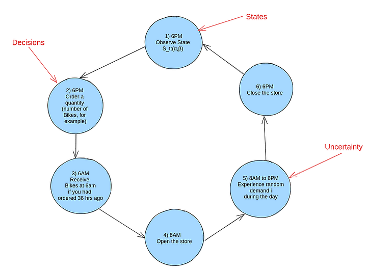
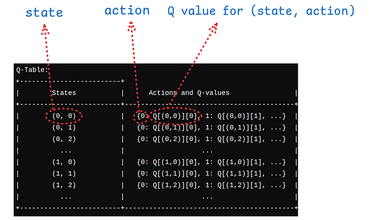
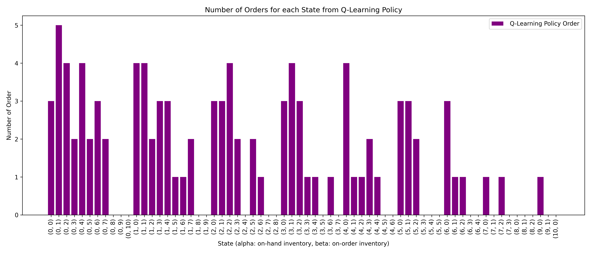
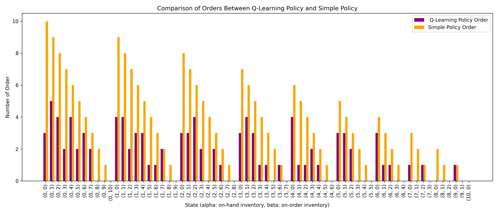
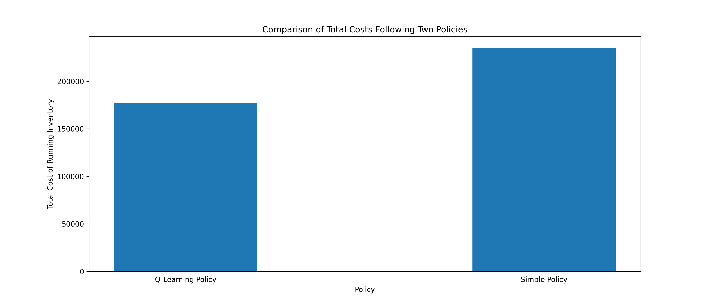

---
html:
  embed_local_images: false
  embed_svg: true
  offline: false
  toc: true

print_background: false
---


# Optimize Your Inventory Management with Reinforcement Learning: Hands-on Python Tutorial

A complete guide on how to use reinforcement learning (Q-Learning method) for inventory management with hands-on Python code

## Inventory Management - What Problem Are We Solving?

Imagine you are managing a bike shop. Every day, you need to decide how many bikes to order from your supplier. If you order too many, you incur high holding costs (cost of storing bikes overnights); if you order too few, you might miss out on potential sales. The challenge is to develop a strategy that balances these trade-off optimally.
Inventory optimization is a crucial problem in various industries, where the goal is to determine the optimal quantity of products to order periodically to maximize profitability. Previously, we discussed how to solve this problem using Dynamic Programming (DP) with the Markov Decision Process (MDP) [Here](https://medium.com/towards-artificial-intelligence/inventory-optimization-with-dynamic-programming-in-less-than-100-lines-of-python-code-ab1cc58ef34c). 
However, the DP approach requires a complete model of the environment (in this case, need to know the probability distribution of demand), which may not always be available or practical.

Here, the Reinforcement Learning (RL) approach is presented. The goal is to build a "data-driven" agency that learns how many to order from a bike shop in the most optimal way. This post will explore Reinforcement Learning approach, specifically Q-learning, to find the optimal inventory policy.

## How to Frame the Inventory Management Problem?

Before diving into the Q-learning method, it's essential to understand the basics of the inventory optimization problem. At its core, inventory optimization is a Sequential Decision-Making Problem, where decisions made today affect the outcomes and choices available tomorrow. Let's break down the key elements of this problem: the state, uncertainty, and recurring decisions.

**State**: What's Happening Right Now?
In the context of a bike shop, the state represents the current situation regarding inventory. It's defined by two key components:
α (Alpha): The number of bikes you currently have in the store. (referred to as On-Hand Inventory)
β (Beta): The number of bikes that you ordered yesterday and are expected to arrive tomorrow morning. These bikes are still in transit. (referred to as On-Order Inventory)
Together, (α,β) form the state, which gives a snapshot of your inventory status at any given moment.

**Uncertainty**: What Could Happen?
Uncertainty in this problem arises from the random demand for bikes each day. You don't know exactly how many customers will walk in and request a bike, making it challenging to predict the exact demand. 

**Decisions**: How many items to order every day?
As the bike shop owner, you face a recurring decision every day at 6 PM: How many bikes should you order from the supplier? Your decision needs to account for both the current state of your inventory (α,β) and also the uncertainty in customer demand for the following day.

Here, this is overview of how inventory management is divided into different steps. A typical 24-hour cycle looks for managing your bike shop's inventory is as follows:

6 PM: Observe the current state St:(α,β) of your inventory. (**State**)
6 PM: Make the decision on how many new bikes to order. (**Decision**)
6 AM: Receive the bikes you ordered 36 hours ago.
8 AM: Open the store to customers.
8 AM - 6 PM: Experience customer demand throughout the day. (**Uncertainty**)
6 PM: Close the store and prepare for the next cycle.

A graphical representation of the inventory management process flow is shown below:


## What is Reinforcement Learning?

Reinforcement Learning (RL) is a machine learning paradigm that focuses on learning how to make sequences of decisions to maximize a cumulative reward. It is inspired by how humans and animals learn through trial and error. In the context of inventory management, RL can be used to learn the optimal ordering policy that minimizes the total cost of inventory management.
The key components of Reinforcement Learning are:

**Agent**: The decision-maker or learner that interacts with the environment.
**Environment**: The external system with which the agent interacts. In this case, the environment is the bike shop and the random customer demand.
**State**: The current situation or snapshot of the environment.
**Action**: The decision or choice made by the agent.
**Reward**: The feedback signal that tells the agent how well it's doing.

The goal of the agent is to learn the optimal policy, which is a mapping from states to actions that maximizes the cumulative reward over time. In the context of inventory management, the policy tells the agent how many bikes to order each day based on the current inventory status and the uncertainty in customer demand.

**Q-Learning**: A Model-Free Reinforcement Learning Algorithm
Q-learning is a model-free reinforcement learning algorithm that learns the optimal action-selection policy for any given state. Unlike the DP approach, which requires a complete model of the environment, Q-learning learns directly from the interaction with the environment (here uncertainty and reward it gets) by updating a Q-table.


## Implementing Q-Learning for Inventory Optimization Problem

Q-learning is a model-free reinforcement learning algorithm that learns the optimal action-selection policy for any given state. Unlike the DP approach, which requires a complete model of the environment, Q-learning learns directly from the interaction with the environment (here uncertainty and reward it gets) by updating a Q-table.

The Key Components of Q-Learning

States: The state represents the current condition of the inventory. In our case:

α: Number of bikes currently in the store.
β: Number of bikes ordered the previous day that will arrive tomorrow.

Actions: The number of bikes to order today.

Q-Table: A table that stores the expected future rewards for each state-action pair.

**Initialization of Q Table**

In this work, the Q-table is initialized as a dictionary named Q. States are represented by tuples (alpha, beta), where:
alpha is the number of items in stock (on-hand inventory).
beta is the number of items on order (on-order inventory).

Actions are possible inventory order quantities that can be taken in each state.
For each state (alpha, beta), the possible actions depend on how much space is left in the inventory ( remaining capacity = Inventory Capacity - (alpha + beta)). The restriction is that the number of items ordered cannot exceed the remaining capacity of the inventory.

The schematic design of Q value is visualized as below:



```python
def initialize_Q(self):
    # Initialize the Q-table as a dictionary
    Q = {}
    for alpha in range(self.user_capacity + 1):
        for beta in range(self.user_capacity + 1 - alpha):
        state = (alpha, beta)
        Q[state] = {}
        max_action = self.user_capacity - (alpha + beta)
        for action in range(max_action + 1):
            Q[state][action] = np.random.uniform(0, 1)  # Small random values
    return Q
```

As teh above code shows, Q-values (Q[state][action]) are initialized with small random values to encourage exploration.

### The Q-Learning Algorithm

The Q-learning algorithm iteratively updates the Q-table using the following equation:

$$Q(s, a) \leftarrow Q(s, a) + \alpha \left[ \text{reward} + \gamma \max_{a'} Q(s', a') - Q(s, a) \right]$$

Where s is the current state, a is the action taken, s' is the next state, \( α \) is the learning rate. and \( γ \) is the discount factor.

We implemented this equation as below in Python:

$$
\underline{\text{td\_target}} = \text{reward} + \gamma \max_{a'} Q(s', a')
$$

$$
\underline{\text{td\_error}} = \underline{\text{td\_target}} - Q(s, a)
$$

$$
Q(s, a) \leftarrow Q(s, a) + \alpha \left( \underline{\text{td\_error}} \right)
$$

The translation of the above equations to Python code is as follows:
    
```python
def update_Q(self, state, action, reward, next_state):
        # Update the Q-table based on the state, action, reward, and next state
        best_next_action = max(self.Q[next_state], key=self.Q[next_state].get)
       
        td_target = reward + self.gamma * self.Q[next_state][best_next_action]
        td_error = td_target - self.Q[state][action]
        self.Q[state][action] += self.alpha * td_error
```

### Simulating Transitions and Rewards in Q-Learning for Inventory Optimization

The current state is represented by a tuple (alpha, beta), where:
alpha is the current on-hand inventory (items in stock), beta is the current on-order inventory (items ordered but not yet received), init_inv calculates the total initial inventory by summing alpha and beta.

Then, we need to simulate customer demand using Poisson distribution with mean value "self.poisson_lambda". Here, the demand shows the randomness of customer demand:

```python
alpha, beta = state
init_inv = alpha + beta
demand = np.random.poisson(self.poisson_lambda)
```

Note: Poisson distribution is used to model the demand, which is a common choice for modeling random events like customer arrivals. However, we can either train the model with historical demand data or live interaction with environment in real time. In its core, reinforcement learning is about learning from the data, and it does not require prior knowledge of model.

Now, the "next alpha" which is in-hand inventory can be written as max(0,init_inv-demand) . What that means is that if demand is more than initial inventory, then the new alpha would be zero, if not, init_inv-demand.
The cost comes in two parts. The **holding cost**: is calculated by multiplying the number of bikes in the store by the per-unit holding cost. Then, we have another cost, which is **stockout cost**. It is a cost that we need to pay for the cases of missed demand. These two parts form the "reward" which we try to maximize using reinforcement learning method.( a better way to put is we want to minimize the cost, so we maximize the reward).

```python
new_alpha = max(0, init_inv - demand)
holding_cost = -new_alpha * self.holding_cost
stockout_cost = 0

if demand > init_inv:
    
    stockout_cost = -(demand - init_inv) * self.stockout_cost
        
reward = holding_cost + stockout_cost
next_state = (new_alpha, action)
```

### Exploration - Exploitation in Q-Learning

Choosing action in Q-learning involves some degree of exploration to get an overview of the Q value for all the states in the Q table. To do that, at every action chosen, there is an epsilon chance that we take an exploration approach and "randomly" select an action, whereas, with a 1-ϵ chance, we take the best action possible from the Q table.

```python
def choose_action(self, state):

        # Epsilon-greedy action selection
    if np.random.rand() < self.epsilon:
        
          return np.random.choice(self.user_capacity - (state[0] + state[1]) + 1)
    
    else:
        
        return max(self.Q[state], key=self.Q[state].get)
```

### Training RL Agent

The training of the RL agent is done by the "train" function, and it is follow as: First, we need to initialize the Q (empty dictionary structure). Then, experinces is collected in each batch (self.batch.append((state, action, reward, next_state))), and the Q table is updated at the end of each batch (self.update_Q(self.batch)).
The number of episodes is limited to "max_actions_per_episode" in each batch. The number of episodes is the number of times the agent interacts with the environment to learn the optimal policy.

Each episode starts with a randomly assigned state, and while the number of actions is lower than max_actions_per_episode, the collecting data for that batch continues.
 
```python
def train(self):

        self.Q = self.initialize_Q()  # Reinitialize Q-table for each training run

        for episode in range(self.episodes):
            alpha_0 = random.randint(0, self.user_capacity)
            beta_0 = random.randint(0, self.user_capacity - alpha_0)
            state = (alpha_0, beta_0)
            #total_reward = 0
            self.batch = []  # Reset the batch at the start of each episode
            action_taken = 0
            while action_taken < self.max_actions_per_episode:
                action = self.choose_action(state)
                next_state, reward = self.simulate_transition_and_reward(state, action)
                self.batch.append((state, action, reward, next_state))  # Collect experience
                state = next_state
                action_taken += 1
            
            self.update_Q(self.batch)  # Update Q-table using the batch
```

## Example Case and Results

This is example case is on how to pull together all above codes, and see how the Q-learning agent learns the optimal policy for inventory management.Here, *user_capicty* (capacity of storage) is 10, which is the total number of items that inventory can hold (capacity). Then,the *poisson_lambda* is the lambda term in the demand distribution, which has a value of 4. Holding costs is 8, which is the cost of holding an item in inventory overnight, and stockout cost, which is the cost of missed demand (assume that the item had a customer that day and the price of the item was, but you did not have the item in your inventory) is 10. *gamma* value lower than one is needed in the equation to discount the future reward (0.9), where *alpha* (learning rate ) is 0.1. The *epsilon* term is the term control exploration-exploitation dilemma. The episodes are 1000, and each batch consists of 1000 (max actions per episode).

```python
# Example usage:
user_capacity = 10
poisson_lambda = 4
holding_cost = 8
stockout_cost = 10
gamma = 0.9
alpha = 0.1
epsilon = 0.1
episodes = 1000
max_actions_per_episode = 1000
```

Having defined these initial parameters of the model, we can define the ql Python class, then use the class to train, and then use the module "get_optimal_policy()" to get the optimal policy.


```python
# Define the Class
ql = QLearningInventory(user_capacity, poisson_lambda, holding_cost, stockout_cost, gamma, 
                        alpha, epsilon, episodes, max_actions_per_episode)

# Train Agent
ql.train()

# Get the Optimal Policy
optimal_policy = ql.get_optimal_policy()
```

**Results**

Now that we have the policy found from the Q-learning method, we can visualize the results and see what they look like. The x-axis is states, which is a tuple of (alpha, beta), and the y-axis is the "Number of Order" found from Q-learning at each state.



Couples of learning can be done by looking at the plot. First, as we go toward the right, we see that the number of orders decreases. When we go right, the alpha value increases (in-hand inventory), meaning we need to "order" less, as inventory in place can fulfill the demand. Secondly, When alpha is constant, with increasing beta, we lower the order of new sites. It can be understood that this is due to the fact that when "we have more item "on order" we do not need increase the orders.


**Compare the Policy to Base Line**

Now that we used Q-learning to find the policy (how many items to order given state) , now we can compare it to the baseline policy.
The baseline policy is just to "order up to policy", which simply means you look at on-hand inventory and the on-order inventory and order up to "meet the capacity of the inventory". We can write simple code to write this policy in Python format here:

```python
# Create a simple policy
def order_up_to_policy(state, user_capacity, target_level):
    alpha, beta = state
    max_possible_order = user_capacity - (alpha + beta)
    desired_order = max(0, target_level - (alpha + beta))
    return min(max_possible_order, desired_order)
```

In the code, the target_level is the desired value we want to order for inventory. If target_level = user_capacity, then we are filling just to fulfill the inventory.
First, we can compare the policies of these different methods. For each state, what will be the "number of orders" if we follow the simple policy and the one from the Q-learning policy? In the figure below, we plotted the comparison of two policies.



The simple policy is just to order so that it fulfill the inventory, where the Q-learning policy order is often lower than the simple policy order. 

**This can be attributed to the fact that "poisson_lambda" here is 4, meaning the demand is much lower than the capacity of the inventory=10, therefore it is not optimal to order "high number of bicycle" as it high cost of "holding cost.**


We can also compare the total cumulative rewards you can get when you apply both policies. To do that, we can use the test policy function of  "QLearningInventory" which it was especially designed to to evaluate policies:

```python
def test_policy(self, policy, episodes):
        """
        Test a given policy on the environment and calculate the total reward.

        Args:
            policy (dict): A dictionary mapping states to actions.
            episodes (int): The number of episodes to simulate.

        Returns:
            float: The total reward accumulated over all episodes.
        """
        total_reward = 0
        alpha_0 = random.randint(0, self.user_capacity)
        beta_0 = random.randint(0, self.user_capacity - alpha_0)
        state = (alpha_0, beta_0)  # Initialize the state
        
        for _ in range(episodes):

            action = policy.get(state, 0)
            next_state, reward = self.simulate_transition_and_reward(state, action)
            total_reward += reward
            state = next_state

        return total_reward
```

The way the function works is it starts randomly with a new state (state = (alpha_0, beta_0); then for that state, you get action (number of order) for that state from policy, you act and see the reward, and next state, and the process continues as total number of episodes, while you collect total reward.




The plot above compares the total cost of managing inventory when we follow the "Q-Learning" and "Simple Policy". The aim is to mimimize the cost of running inventory. Since the 'reward' in our model represents this cost, we added total cost = -total reward. Running the inventory with Q-Learning policy will lead to lower costs compared to the simple policy.

## Code in Github

The full code for the this blog can be found in the Github repository [Here](https://github.com/Peymankor/medium_blogs/blob/main/2024/08-Aug/RL-Inventory/main.py).

## Summary and Main Takeaways

In this post, we worked on how Reinforcement learning (Q-Learning Specifically) can be used to optimize inventory management. We framed the problems as sequential decision making, and we were able to develop a Q-learning algorithm that learns the optimal ordering policy through interaction with the environment (uncertainly). Here, the environment was the "random" demand of the customers (buyers of bikes), and the state was the current inventory status (alpha, beta). The Q-learning algorithm was able to learn the optimal policy that minimizes the total cost of inventory management.

**Main Takeaways**

1. **Sequential Decision-Making**: Inventory management can be effectively framed as a sequential decision-making problem, where today's decisions impact future outcomes.
2. **Q-Learning**: A model-free reinforcement learning algorithm, Q-learning, can be used to find the optimal inventory policy without requiring a complete model of the environment.
3. **State Representation**: The state in inventory management is represented by the current on-hand inventory and on-order inventory state = ($\alpha , \beta$).
4. **Cost Reduction**: We can see that Q-learning policy leads to lower costs compared to the simple policy of ordering up to the capacity.
5. **Flexibility**: The Q-learning approach is quite flexible and can be applied to the case of we have past data of demand, or we can interact with the environment to learn the optimal policy.
6. **Data-Driven Decisions**: As we showed, the Reinforcement learning approach does not require any prior knowledge on the model of environment , as it is learning from the data.

## References

You can read this example more in-depth in [“Foundation of Reinforcement Learning with Application in Finance”](https://www.amazon.com/Foundations-Reinforcement-Learning-Applications-Finance/dp/1032124121). However, I have rewritten Python codes in this blog to make it easier to understand.
